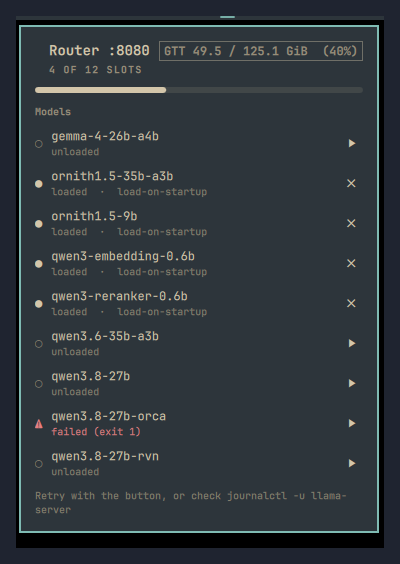

# modelctl

An Omarchy bar widget for a local [llama.cpp](https://github.com/ggml-org/llama.cpp)
**router**: see which models are loaded, which ones died, how much memory the pool
has left, and load or unload any of them with one click.

The router serves several models at once behind a single endpoint. That is what
this widget is for. It has little to say about a single-model setup like a plain
Ollama install.



## Why

A model that fails to load reports the same `unloaded` state as one that is
merely idle. Nothing on the desktop tells them apart, so a router that came up
with three dead models looks exactly like a healthy, idle one. You find out
later, when an agent answers `400 model is not loaded`.

This widget puts that difference in the bar: the icon turns urgent the moment a
model enters `failed`, and the panel shows the exit code next to its name.

## What the panel shows

- **Router line** with the endpoint it queried and how many slots are in use.
- **Memory meter** for the pool the models compete for: GTT on an AMD APU, VRAM
  on a discrete card. Machines that expose neither simply get no meter.
- **One row per model**: `●` loaded, `○` unloaded, `⚠` failed with its exit code,
  `◌` sleeping, and a real progress bar while it loads. Models that are `load-on-startup`, an
  embedding, or a reranker are marked as protected.
- **A button per row** to load or unload, with a confirmation before unloading a
  protected model or before a load that would evict another one.
- **The model source at the bottom**: the `--models-preset` file (or the
  `--models-dir`) the running router was started with, read from its own command
  line. Click it to open that file in your Omarchy editor. Adding a model there
  needs a router restart.

Left click opens the panel, middle click forces a refresh, and hovering the icon
shows a one-line summary.

## Requirements

- Omarchy 4 with `omarchy-shell`.
- A llama.cpp server started in router mode (`--models-preset`).
- Python 3 for the bundled helper. No third-party packages.

## Install

```bash
omarchy plugin add https://github.com/macuartin/modelctl.git --enable
```

Or by hand: drop this directory in `~/.config/omarchy/plugins/macuartin.modelctl/`,
then `omarchy-shell shell rescanPlugins` and `omarchy plugin enable macuartin.modelctl`.

## Uninstall

```bash
omarchy plugin disable macuartin.modelctl
omarchy plugin remove macuartin.modelctl
```

`disable` takes the widget out of the bar, `remove` deletes the plugin
directory. If you also symlinked the helper into your path, drop it by hand:

```bash
rm -f ~/.local/bin/modelctl
```

The widget keeps no state of its own, so nothing else is left behind.

## Settings

Set them with `omarchy bar set macuartin.modelctl <key> <value>` (numbers need `--json`).

| Key | Default | What it does |
|---|---|---|
| `routerUrl` | `http://127.0.0.1:8080` | Router endpoint |
| `apiKeyFile` | `~/.config/llama-server.env` | File holding `API_KEY=` |
| `modelctlPath` | bundled | Path to the helper, if you want your own |
| `notifyFailed` | `true` | Desktop notification the first time a model fails |

## The helper

`scripts/modelctl` is a standalone CLI, useful on its own:

```bash
modelctl                      # status
modelctl status --json        # the contract the widget reads
modelctl load <model>
modelctl unload <model>       # --force overrides the protection
modelctl restore              # reload the load-on-startup set
```

Symlink it into your `PATH` if you want it outside the widget:

```bash
ln -s ~/.config/omarchy/plugins/macuartin.modelctl/scripts/modelctl ~/.local/bin/modelctl
```

The router is the single source of truth. Model configuration comes from
`status.preset`, while the live context size comes from `status.args`, because
the preset is the `.ini` text and can drift from the running process.

## Notes

**Never ask `/metrics` for an unloaded model.** The router loads it to answer,
which can mean tens of gigabytes for one stray request. This widget only ever
reads `GET /models`.

**The widget follows `GET /models/sse`, it does not poll.** `scripts/modelctl watch`
holds the stream open and prints one complete snapshot per line as NDJSON, so a
failure reaches the bar the moment it happens and a slow load reports per-stage
progress. The stream is restarted automatically if it dies. Note that the build
emits `status_change` where the documentation says `model_status`; both are
accepted.

**Loading is asynchronous.** The router returns `{"success":true}` long before
the model is up, so the CLI polls until the state actually changes.

**`--models-max 0` is documented as unlimited but does not behave that way.**
The router refuses to start when the startup set is larger than the cap, and 0
loses to any startup model: `number of models to load on startup (4) exceeds
models_max (0)`. Set a high number instead. When the cap cannot be read at all,
this widget says nothing about slots rather than inventing a plausible one.

**The API key never reaches QML.** Plugins run unsandboxed inside the shell, so
the panel shells out to the helper and the helper is what reads the key file.

## License

MIT. See [LICENSE](LICENSE).
